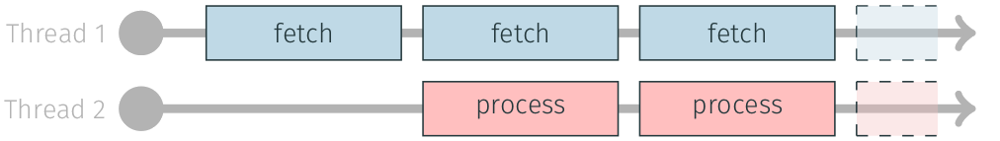

 [](https://eotransform.readthedocs.io/en/latest/?badge=latest) [](https://zenodo.org/badge/latestdoi/541624588)
# eotransform

Defines the basic transform protocol to be used in the streamed source to sink concept. Also provides some generic 
transformer implementations such as `Compose` or `Result`.

## What can I use eotransform for?

The eotransform package defines Source, Transform, and Sink protocols, to facilitate the creation of modularised processing pipelines.
Adhering to a common contract, makes it easier to mix and match processing blocks, allowing for better code reusage, and more flexible pipelines.
We also provide a `streamed_process` function, which you can use for I/O hiding when implementing these protocols.
The package also provides some common transformations, and sinks like `Compose` or `Result`.

## Getting Started

### Installation
```bash
pip install eotransform
```

### Examples

#### Transformer protocol
This example shows how to implement the `Transformer` protocol for a simple multiplication:

<!-- snippet: example_transformer_multiply -->
<a id='snippet-example_transformer_multiply'></a>
```py
class Multiply(Transformer[int, int]):
    def __init__(self, factor: int):
        self.factor = factor

    def __call__(self, x: int) -> int:
        return x * self.factor
```
<sup><a href='/tests/test_doc_examples.py#L10-L17' title='Snippet source file'>snippet source</a> | <a href='#snippet-example_transformer_multiply' title='Start of snippet'>anchor</a></sup>
<!-- endSnippet -->

#### Sink protocol
This code snippet illustrates how to implement the `Sink` protocol, using a simple accumulation example:

<!-- snippet: example_sink_accumulate -->
<a id='snippet-example_sink_accumulate'></a>
```py
class AccumulatingSink(Sink[int]):
    def __init__(self):
        self.result = 0

    def __call__(self, x: int) -> None:
        self.result += x
```
<sup><a href='/tests/test_doc_examples.py#L20-L27' title='Snippet source file'>snippet source</a> | <a href='#snippet-example_sink_accumulate' title='Start of snippet'>anchor</a></sup>
<!-- endSnippet -->


#### Streamed pipeline using the "Result" pattern
In the following example we show how to combine `ApplyToOkResult` and `SinkUnwrapped` to process data in a streamed fashion with proper error handling across thread boundaries.

<!-- snippet: example_streamed_results -->
<a id='snippet-example_streamed_results'></a>
```py
def a_data_source():
    for i in range(4):
        if i == 1:
            yield Result.error(RuntimeError("A runtime error occured!"))
        else:
            yield Result.ok(i)

accumulated = AccumulatingSink()
sink = SinkUnwrapped(accumulated, ignore_exceptions={RuntimeError})
with ThreadPoolExecutor(max_workers=3) as ex:
    streamed_process(a_data_source(), ApplyToOkResult(Multiply(2)), sink, ex)

assert accumulated.result == 10
```
<sup><a href='/tests/test_doc_examples.py#L30-L44' title='Snippet source file'>snippet source</a> | <a href='#snippet-example_streamed_results' title='Start of snippet'>anchor</a></sup>
<!-- endSnippet -->

## Streaming
The following briefly describes the concept of streaming, and how it can be used to hide I/O processes.

The most straightforward way to process data is to first load it and then process it:


This has the advantage of being simple to implement and maintain, as you don't need to be concerned with issues of parallelism.

For many cases this will work sufficiently well, however, it can stall your processing pipeline because it needs to wait for data to be fetched.
Often an easy way to increase throughput, is to interleave the I/O or data fetching with processing chunks:



With this streaming process you can utilise resources more effectively.

## Support & Documentation

- [Documentation](https://eotransform.readthedocs.io/)
- GitHub: [https://github.com/TUW-GEO/eotransform](https://github.com/TUW-GEO/eotransform)

### Dependencies
eotransform requires Python 3.8 and has these dependencies:

<!-- snippet: dependencies -->
<a id='snippet-dependencies'></a>
```cfg
more-itertools
```
<sup><a href='/setup.cfg#L30-L32' title='Snippet source file'>snippet source</a> | <a href='#snippet-dependencies' title='Start of snippet'>anchor</a></sup>
<!-- endSnippet -->

## Citation

If you find this repository useful, please consider giving it a star or a citation:
```bibtex
@software{raml_bernhard_2023_8002789,
  author       = {Raml, Bernhard},
  title        = {eotransform},
  month        = jun,
  year         = 2023,
  note         = {{If you use this software, please cite it using the 
                   metadata from this file.}},
  publisher    = {Zenodo},
  version      = {1.8.2},
  doi          = {10.5281/zenodo.8002789},
  url          = {https://doi.org/10.5281/zenodo.8002789}
}
```
